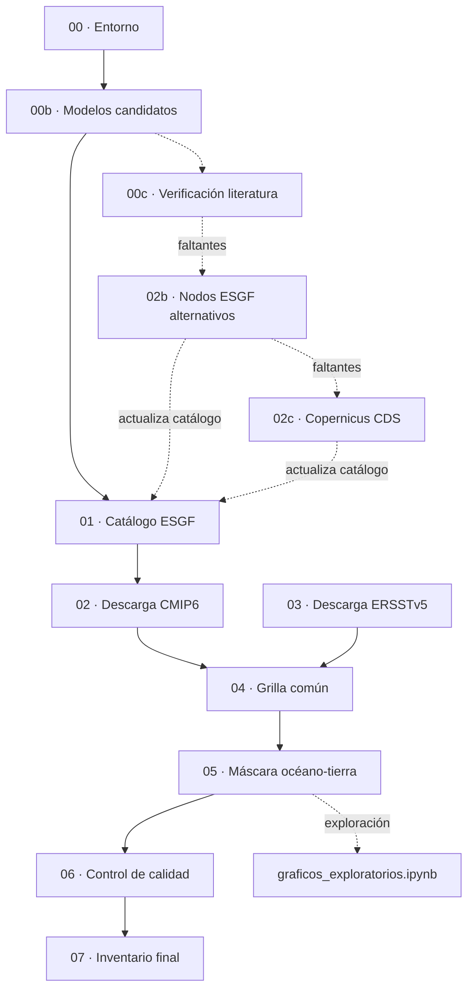

# Pipeline de datos SST — CMIP6 + ERSSTv5 (Niño 1+2 / Niño 3.4)

Este repositorio contiene el pipeline de datos utilizado para calcular el *Time of Emergence* (TOE) de la temperatura superficial del mar en las regiones Niño 1+2 y Niño 3.4. El proceso abarca la adquisición de los modelos CMIP6 y del dato observado de referencia (ERSSTv5), su homogeneización y su control de calidad, hasta obtener un producto final listo para el análisis.

La ejecución se realiza mediante un único orquestador (`run.sh [STEP_FROM] [STEP_TO] [MAX_MODELS]`). El procesamiento numérico se implementó en CDO, con excepción de la máscara océano-tierra (paso 05), reescrita en Python/`numpy` tras identificarse un error de cálculo en la cadena original de CDO (ver paso 05). El pipeline **no genera gráficos**: estos se producen bajo demanda desde `graficos_exploratorios.ipynb`, a partir del dato final (`data/processed/masked/`).

## Flujograma



Las líneas punteadas corresponden a pasos manuales, fuera de la secuencia automática de `run.sh`.

## Estructura de datos

```
data/raw/cmip6/<modelo>/<experimento>/<chunk>.nc   # 02: crudo, grilla nativa, sin fusionar
data/raw/ersstv5/                                  # 03: observado, crudo
data/interim/.weights/<modelo>.nc                  # 04: pesos de regrilla, uno por modelo (cache)
data/interim/processed/tos_<modelo>_<exp>.nc       # 04: regrillado + fusionado + homogeneizado
data/interim/ocean_mask.nc                         # 05: máscara 1=océano
data/processed/masked/tos_<modelo>_<exp>.nc        # 05: dato final, listo para el cálculo de TOE
data/processed/qc_report.csv                       # 06
data/processed/models_inventory_final.csv          # 07
figures/                                            # graficos_exploratorios.ipynb (manual)
```

`data/interim/` no es un directorio de paso vacío: contiene el dato ya regrillado pero **todavía sin máscara** (`processed/`, insumo del paso 05) y artefactos auxiliares reutilizados entre corridas (catálogo ESGF, la máscara en sí, los pesos de regrilla cacheados por modelo). El nombre `data/interim/processed/` puede confundirse con `data/processed/`; se trata de cosas distintas: `interim/processed` es un paso intermedio (sin máscara), mientras que `data/processed/masked` es el dato final.

`run.sh` **no escribe ningún PNG**. Todo el graficado (mapas, series de caja, control de calidad, boxplots) se realiza desde `graficos_exploratorios.ipynb`, que lee directamente `data/processed/masked/`, calcula lo necesario en el momento (por ejemplo, promedios de caja) y guarda los PNG en `figures/`, fuera de `data/`.

## Pasos

### 00 — Verificación de entorno (`00_setup_env.sh`)
Confirma la disponibilidad de CDO, Python y las librerías necesarias (`requests`, `netCDF4`, `matplotlib`) antes de iniciar la ejecución.

### 00b — Lista de modelos candidatos (`00b_build_model_list.py`)
Revisa el vocabulario CMIP6 completo y selecciona, por modelo, la grilla (`grid_label`) más gruesa que cubre `historical` + `ssp245` + `ssp585`. El resultado se escribe en `../config/models_seed_cmip6.csv`.

### 00c — Verificación contra la literatura (`00c_check_paper_models.py`, manual)
Compara los modelos citados en `files_MD/` contra ese catálogo. Los faltantes se registran en `../config/models_missing_from_esgf.csv`, insumo de 02b/02c.

### 01 — Catálogo ESGF (`01_query_esgf_catalog.py`)
Para cada modelo, determina el `variant_label` (miembro de ensamble) disponible simultáneamente en los tres experimentos —se prioriza `r1i1p1f1`— y localiza los archivos de esa combinación exacta. El resultado se escribe en `models_catalog_status.csv` y `esgf_file_urls.json`.

> Un hallazgo relevante durante el desarrollo: sin fijar un único miembro, ESGF devuelve varias realizaciones (r1i1p1f1, r2i1p1f1, …) del mismo modelo. Sin ese filtro, se descargan y fusionan todas como si fueran una sola serie, duplicando artificialmente los pasos de tiempo.

### 02b / 02c — Fuentes alternativas (manual)
`02b_search_alt_esgf_nodes.py` repite la búsqueda de 01 contra nodos ESGF alternativos (CEDA, DKRZ, IPSL, …) para los modelos no encontrados en el nodo principal. `02c_download_copernicus_cds.py` constituye el último recurso, mediante credenciales personales de Copernicus CDS. Ninguno de los dos forma parte de la secuencia automática; se ejecutan manualmente y, de tener éxito, actualizan los mismos `models_catalog_status.csv` / `esgf_file_urls.json` que usa 01.

### 02 — Descarga CMIP6 (`02_download_cmip6_chunks.sh`)
Descarga cada archivo tal como lo entrega ESGF, sin fusionar ni recortar, en `data/raw/cmip6/<modelo>/<experimento>/`. El parámetro `MAX_MODELS` limita cuántos modelos completos se descargan, en el orden del catálogo.

### 03 — ERSSTv5 (`03_download_ersstv5.sh`)
Descarga el dato observado de NOAA PSL, aísla la variable `sst` (`-selvar,sst`, descartando `lat_bnds`/`lon_bnds`/etc. desde el origen) y recorta a la ventana regional (100°E–70°W, 20°S–20°N). El resultado (`ersstv5_region.nc`) queda como una grilla `lonlat` única y limpia; sin este paso, CDO detectaba un segundo grid "generic" a partir de las variables de bounds y lo empleaba erróneamente como objetivo de regrillado en el paso 04. Esta grilla (~2°) constituye la referencia para 04.

### 04 — Procesamiento a grilla común (`04_process_to_common_grid.sh`)
Por modelo, en el siguiente orden:
1. **Pesos de regrilla, calculados una sola vez por modelo**: se detecta el `gridtype` nativo (`cdo griddes` sobre el primer chunk crudo disponible) y se calculan los pesos hacia la grilla de ERSSTv5 con `gencon` (si es `unstructured`, como en AWI-CM-1-1-MR/FESOM, dado que `genbil` no soporta mallas no estructuradas) o `genbil` en los demás casos. Se almacenan en `data/interim/.weights/<modelo>.nc` y se reutilizan para los tres experimentos, dado que la grilla nativa de un modelo no varía entre historical/ssp245/ssp585.
2. `cdo remap` con esos pesos, chunk por chunk, lo que además recorta el dominio a la ventana regional.
3. `mergetime` de los chunks regrillados de un mismo periodo (historical, ssp245, ssp585 permanecen separados).
4. Recorte de años según el periodo (historical 1850–2014; ssp245/ssp585 2015–2100).
5. Asignación del atributo de calendario `standard` cuando no está presente.
6. Conversión de unidades (K → degC) cuando corresponde.

Salida: `data/interim/processed/tos_<modelo>_<exp>.nc`, un archivo por modelo/experimento, ya en la grilla del observado.

### 05 — Máscara océano-tierra (`05_apply_ocean_mask.py`, Python)
Se construye una máscara 1=océano a partir de los puntos válidos de ERSSTv5 (no se emplea `sftlf` por modelo, para evitar inconsistencias de grilla entre `tos` y `sftlf` observadas en algunos modelos): un punto se considera océano si registra al menos un mes válido en todo el periodo de ERSSTv5. La máscara se aplica a todos los archivos de 04. Salida: `data/processed/masked/`, el dato final.

> Este paso fue reescrito de CDO a Python porque la cadena original (`mulc,0 -> setmisstoc,-1 -> addc,1` sobre el `timmean` de ERSSTv5) calculaba incorrectamente la máscara: `cdo mulc,0` multiplica el propio valor de relleno (`_FillValue` ≈ `-9.97e+36`) por 0, resultando en ≈0, valor que ya no coincide con `_FillValue`; en consecuencia, los puntos de tierra dejaban de quedar marcados como faltantes. La máscara resultante asignaba océano=1 en todo el dominio, incluida la tierra. Con `numpy.ma` el manejo de valores faltantes es explícito (vía `_FillValue`/`missing_value`), lo que evita ese problema. Tras la corrección: 1841/2016 puntos de océano (91.3 %).

### 06 — Control de calidad (`06_qc_checks.py`)
Por archivo, se evalúa el rango físico de la SST (−2 a 39 °C) y la longitud temporal esperada (10 % de tolerancia). El resultado se escribe en `qc_report.csv`.

> El límite superior se incrementó de 35 a 39 °C tras investigar los `FAIL` de varios modelos en `ssp245`/`ssp585`. Dos de los tres extremos revisados (ACCESS-CM2 ~100°E/4°N, Estrecho de Malaca; ACCESS-ESM1-5 ~260°E/16°N, costa de Centroamérica) correspondían a océano real, con patrón estacional coherente y tendencia de calentamiento hacia fin de siglo bajo escenarios de alta emisión. El tercero (AWI-CM-1-1-MR, ~124°E/-18°N) correspondía a un punto de tierra que el error de la máscara (paso 05) dejaba sin enmascarar; corregida la máscara, el extremo desaparece. Tras la corrección, las nueve combinaciones modelo×experimento superan el control de calidad.

### 07 — Inventario final (`07_build_inventory_report.py`)
Combina el resultado del control de calidad con la resolución real de cada modelo (`cdo griddes`) en una tabla resumen con los modelos finalmente seleccionados.

### `graficos_exploratorios.ipynb` (manual, no forma parte de `run.sh`)
Notebook con el graficado completo, sobre `data/processed/masked/`. Los promedios de caja se calculan al momento, sin quedar precalculados en disco. Los PNG se guardan en `figures/`. Contiene cuatro secciones:
1. **Mapas**: promedio temporal del campo completo, por modelo/experimento o para ERSSTv5.
2. **Series de caja** (`plot_box_series`): un modelo, con los tres periodos superpuestos en el mismo eje (historical en gris; ssp245 en azul, alpha 0.8; ssp585 en rojo, alpha 0.8).
3. **Resumen de control de calidad**: PASS/FAIL por modelo, a partir de `qc_report.csv`.
4. **Boxplot** (`plot_box_boxplot`, reutilizable para Niño 3.4, Niño 1+2 o cualquier otra caja): periodo histórico, una caja por fuente (modelos + ERSSTv5), restringidas a la intersección de años común a todas las fuentes (calculada automáticamente) para que la comparación de dispersión (σ) y mediana (p50) sea directa entre fuentes.

## Convenciones

- **Idempotencia**: todo paso que procesa datos por modelo verifica si la salida ya existe y la omite en ese caso, lo que permite reanudar o ampliar `MAX_MODELS` sin repetir trabajo.
- **`MODELS` (variable de entorno, opcional)**: restringe el paso 04 a una lista de modelos separada por espacios (`MODELS="ACCESS-CM2 ACCESS-ESM1-5" bash scripts/04_process_to_common_grid.sh`), útil para procesar modelos ya descargados mientras otros siguen en curso.
- **Un solo miembro de ensamble** (`variant_label`) por modelo, consistente en los tres experimentos (ver paso 01).
- **Mallas no estructuradas** (por ejemplo, AWI-CM-1-1-MR/FESOM): `genbil`/`remapbil` no las soporta. El paso 04 detecta el `gridtype` nativo y emplea `gencon` automáticamente en ese caso; la salida queda en la misma grilla que los demás modelos, independientemente del método usado.
