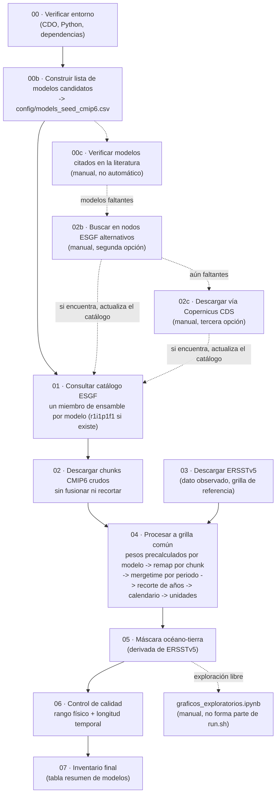

# Pipeline de datos SST — CMIP6 + ERSSTv5 (Niño 1+2 / Niño 3.4)

Este repositorio documenta cómo armé el pipeline de datos que uso como base para calcular el *Time of Emergence* (TOE) de la temperatura superficial del mar en las regiones Niño 1+2 y Niño 3.4: desde la descarga de los modelos CMIP6 y el dato observado de referencia (ERSSTv5), hasta un dato final limpio, homogéneo y con control de calidad.

Todo se corre con un solo orquestador: `run.sh [STEP_FROM] [STEP_TO] [MAX_MODELS]`. El procesamiento numérico lo hago con CDO, salvo la máscara océano-tierra (paso 05), que reescribí en Python/`numpy` después de detectar que la cadena de CDO la calculaba mal (lo cuento más abajo). El pipeline **no genera gráficos**: eso lo hago aparte, a demanda, desde `graficos_exploratorios.ipynb`, sobre el dato ya terminado (`data/processed/masked/`).

## Flujograma



Las líneas punteadas son pasos manuales, fuera de la secuencia automática de `run.sh`.

## Estructura de datos

```
data/raw/cmip6/<modelo>/<experimento>/<chunk>.nc   # 02: crudo, grilla nativa, sin fusionar
data/raw/ersstv5/                                  # 03: observado, crudo
data/interim/.weights/<modelo>.nc                  # 04: pesos de regrilla, uno por modelo (cache)
data/interim/processed/tos_<modelo>_<exp>.nc       # 04: regrillado + fusionado + homogeneizado
data/interim/ocean_mask.nc                         # 05: máscara 1=océano
data/processed/masked/tos_<modelo>_<exp>.nc        # 05: dato final, listo para el cálculo de TOE
data/processed/qc_report.csv                       # 06
data/processed/models_inventory_final.csv          # 07
figures/                                            # graficos_exploratorios.ipynb (manual)
```

`data/interim/` no es un directorio de paso vacío: ahí guardo el dato ya regrillado pero **todavía sin máscara** (`processed/`, insumo del paso 05) y artefactos auxiliares pequeños que reutilizo entre corridas (catálogo ESGF, la máscara en sí, los pesos de regrilla cacheados por modelo). El nombre `data/interim/processed/` se puede confundir con `data/processed/` — son cosas distintas: `interim/processed` es un paso intermedio (sin máscara), `data/processed/masked` es el dato final.

`run.sh` **no escribe ningún PNG**. Todo el graficado (mapas, series de caja, QC, boxplots) lo hago desde `graficos_exploratorios.ipynb`, leyendo directamente `data/processed/masked/`, calculando lo que haga falta al momento (por ejemplo, promedios de caja) y guardando los PNG en `figures/` — fuera de `data/`, para no ensuciar el árbol de datos del pipeline.

## Pasos

### 00 — Verificar entorno (`00_setup_env.sh`)
Confirmo que CDO, Python y las librerías necesarias (`requests`, `netCDF4`, `matplotlib`) estén disponibles antes de correr nada.

### 00b — Lista de modelos candidatos (`00b_build_model_list.py`)
Reviso el vocabulario CMIP6 completo y elijo, por modelo, la grilla (`grid_label`) más gruesa que cubre `historical` + `ssp245` + `ssp585`. El resultado queda en `../config/models_seed_cmip6.csv`.

### 00c — Verificación contra la literatura (`00c_check_paper_models.py`, manual)
Comparo los modelos citados en `files_MD/` contra ese catálogo. Los que faltan van a `../config/models_missing_from_esgf.csv`, insumo de 02b/02c.

### 01 — Catálogo ESGF (`01_query_esgf_catalog.py`)
Por modelo, determino el `variant_label` (miembro de ensamble) disponible en los tres experimentos a la vez —prefiero `r1i1p1f1`— y busco los archivos de esa combinación exacta. El resultado queda en `models_catalog_status.csv` y `esgf_file_urls.json`.

> Algo que me costó entender: sin fijar un único miembro, ESGF devuelve varias realizaciones (r1i1p1f1, r2i1p1f1, …) del mismo modelo. Si no filtras, terminas descargando y fusionando todas como si fueran una sola serie, y multiplicas los pasos de tiempo sin darte cuenta.

### 02b / 02c — Fuentes alternativas (manual)
`02b_search_alt_esgf_nodes.py` repite la búsqueda de 01 contra nodos ESGF alternativos (CEDA, DKRZ, IPSL, …) para los modelos que no aparecen en el nodo principal. `02c_download_copernicus_cds.py` es el último recurso: usa mis credenciales personales de Copernicus CDS. Ninguno de los dos forma parte de la secuencia automática; los corro a mano y, si encuentran algo, actualizan los mismos `models_catalog_status.csv` / `esgf_file_urls.json` que usa 01.

### 02 — Descarga CMIP6 (`02_download_cmip6_chunks.sh`)
Descargo cada archivo tal como lo entrega ESGF, sin fusionar ni recortar, en `data/raw/cmip6/<modelo>/<experimento>/`. `MAX_MODELS` limita cuántos modelos completos se descargan, en el orden del catálogo.

### 03 — ERSSTv5 (`03_download_ersstv5.sh`)
Descargo el dato observado de NOAA PSL, me quedo solo con la variable `sst` (`-selvar,sst`, descartando `lat_bnds`/`lon_bnds`/etc. desde el origen) y recorto a la ventana regional (100°E–70°W, 20°S–20°N). El resultado (`ersstv5_region.nc`) queda como una grilla `lonlat` única y limpia — sin este paso, CDO detectaba un segundo grid "generic" a partir de las variables de bounds y lo usaba por error como objetivo de regrillado en el paso 04. Esta grilla (~2°) es la referencia para 04.

### 04 — Procesamiento a grilla común (`04_process_to_common_grid.sh`)
Por modelo, en este orden:
1. **Pesos de regrilla, una sola vez por modelo**: detecto el `gridtype` nativo (`cdo griddes` sobre el primer chunk crudo disponible) y calculo los pesos hacia la grilla de ERSSTv5 con `gencon` (si es `unstructured`, como AWI-CM-1-1-MR/FESOM — `genbil` no soporta mallas no estructuradas) o `genbil` en cualquier otro caso. Los cacheo en `data/interim/.weights/<modelo>.nc` y los reutilizo para los tres experimentos, porque la grilla nativa de un modelo no cambia entre historical/ssp245/ssp585 (lo verifiqué). Si algún modelo rompe ese supuesto, hay que borrar su archivo de pesos y volver a correr.
2. `cdo remap` con esos pesos, chunk por chunk — de paso recorta el dominio, porque la grilla objetivo ya está acotada a la ventana regional.
3. `mergetime` de los chunks ya regrillados de un mismo periodo (historical, ssp245, ssp585 quedan separados).
4. Recorte de años según el periodo (historical 1850–2014; ssp245/ssp585 2015–2100).
5. Calendario: si falta el atributo, le asigno `standard`.
6. Unidades: K → degC si corresponde.

Salida: `data/interim/processed/tos_<modelo>_<exp>.nc`, un archivo por modelo/experimento, ya en la grilla del observado (verificado: misma grilla exacta sin importar si el modelo usó `genbil` o `gencon`).

### 05 — Máscara océano-tierra (`05_apply_ocean_mask.py`, Python)
Construyo una máscara 1=océano a partir de los puntos válidos de ERSSTv5 (no uso `sftlf` por modelo, para evitar inconsistencias de grilla entre `tos` y `sftlf` que vi en algunos modelos): un punto es océano si tiene al menos un mes válido en todo el registro de ERSSTv5. La aplico a todos los archivos de 04. Salida: `data/processed/masked/`, el dato final.

> Este paso lo reescribí de CDO a Python porque la cadena anterior (`mulc,0 -> setmisstoc,-1 -> addc,1` sobre el `timmean` de ERSSTv5) calculaba mal la máscara: `cdo mulc,0` multiplica el propio valor de relleno (`_FillValue` ≈ `-9.97e+36`) por 0, da ≈0, y ese 0 ya no coincide con `_FillValue`, así que los puntos de tierra dejaban de quedar marcados como faltantes (lo confirmé: `timmean` detectaba 175/2016 puntos faltantes, pero tras `mulc,0` quedaban 0). La máscara resultante daba océano=1 en **todo** el dominio, incluida la tierra. Con `numpy.ma` el manejo de faltantes es explícito (vía `_FillValue`/`missing_value`) y no tiene esa trampa. Corregido: 1841/2016 puntos de océano (91.3%).

### 06 — Control de calidad (`06_qc_checks.py`)
Por archivo, reviso el rango físico de la SST (−2 a 39 °C) y la longitud temporal esperada (10 % de tolerancia). El resultado queda en `qc_report.csv`.

> El límite superior lo subí de 35 a 39 °C después de investigar los `FAIL` de varios modelos en `ssp245`/`ssp585`. Dos de los tres extremos que revisé (ACCESS-CM2 ~100°E/4°N, Estrecho de Malaca; ACCESS-ESM1-5 ~260°E/16°N, costa de Centroamérica) resultaron ser océano real: valores que ya existen en la grilla nativa del modelo, con patrón estacional coherente y tendencia de calentamiento hacia fin de siglo bajo escenarios de alta emisión — no un artefacto de interpolación. El tercero (AWI-CM-1-1-MR, ~124°E/-18°N) era un **punto de tierra** que el bug de la máscara (paso 05) dejaba sin enmascarar; con la máscara corregida ese extremo desaparece. Tras corregir la máscara, las 9/9 combinaciones modelo×experimento pasan el control de calidad.

### 07 — Inventario final (`07_build_inventory_report.py`)
Combino el control de calidad con la resolución real de cada modelo (`cdo griddes`) en una tabla resumen con los modelos finalmente seleccionados.

### `graficos_exploratorios.ipynb` (manual, no forma parte de `run.sh`)
Notebook con todo el graficado, sobre `data/processed/masked/`. Los promedios de caja se calculan al momento, no quedan precalculados en disco. Los PNG se guardan en `figures/` (fuera de `data/`). Cuatro secciones:
1. **Mapas**: promedio temporal del campo completo, por modelo/experimento o ERSSTv5.
2. **Series de caja** (`plot_box_series`): un modelo, los tres periodos superpuestos en el mismo eje — historical (gris), ssp245 (azul, alpha 0.8), ssp585 (rojo, alpha 0.8).
3. **Resumen de control de calidad**: PASS/FAIL por modelo a partir de `qc_report.csv`.
4. **Boxplot** (`plot_box_boxplot`, reusable para Niño 3.4, Niño 1+2 o cualquier caja): periodo histórico, una caja por fuente (modelos + ERSSTv5), restringidas a la **intersección de años** común a todas las fuentes (calculada automáticamente, no hardcodeada) para que la comparación de dispersión (σ) y mediana (p50, anotados dentro de cada caja) sea directa entre fuentes.

## Convenciones

- **Idempotencia**: todo paso que toca datos por modelo revisa si la salida ya existe y la salta si es así. Esto me permite reanudar o ampliar `MAX_MODELS` sin repetir trabajo.
- **`MODELS` (variable de entorno, opcional)**: restringe el paso 04 a una lista de modelos separada por espacios (`MODELS="ACCESS-CM2 ACCESS-ESM1-5" bash scripts/04_process_to_common_grid.sh`). Útil para procesar modelos ya descargados mientras otro sigue en curso.
- **Un solo miembro de ensamble** (`variant_label`) por modelo, el mismo en los tres experimentos — ver nota en el paso 01.
- **Mallas no estructuradas** (por ejemplo AWI-CM-1-1-MR/FESOM): `genbil`/`remapbil` no las soporta. El paso 04 detecta el `gridtype` nativo y usa `gencon` automáticamente en ese caso. Verificado: la salida queda en la misma grilla que los demás modelos, sin importar cuál se usó.
