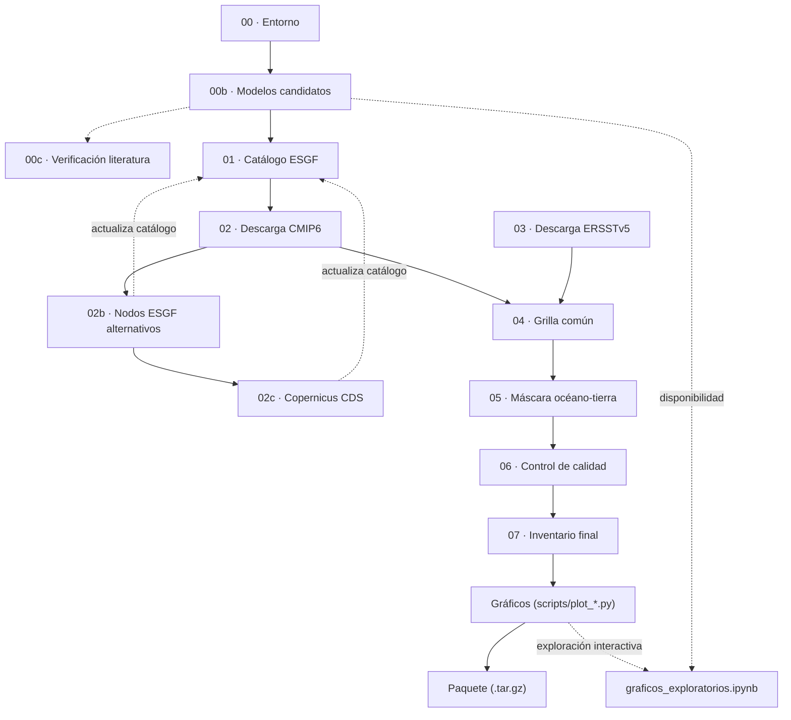

# Pipeline de datos SST — CMIP6 + ERSSTv5 (Niño 1+2 / Niño 3.4)

Pipeline de datos para calcular el *Time of Emergence* (TOE) de la temperatura superficial del mar en las regiones Niño 1+2 y Niño 3.4. Cubre la adquisición de los modelos CMIP6 y del dato observado de referencia (ERSSTv5), su homogeneización y su control de calidad, hasta un producto final listo para el análisis.

## Instalación

Una sola vez, en cualquier máquina Linux:

```
conda env create -f environment.yml
```

De ahí en más, alcanza con `./run.sh` — **no hace falta `conda activate` a mano**: `run.sh` activa el entorno `e1_smn` solo, si lo encuentra creado (ver Convenciones más abajo si igual te aparece un error de dependencias faltando).

Se ejecuta con un único orquestador: `run.sh [STEP_FROM] [STEP_TO] [MAX_MODELS]`. Ejemplo para una prueba rápida (desde el entorno hasta la grilla común, con solo 2 modelos):

```
./run.sh 00 04 2
```

El procesamiento numérico usa CDO, salvo la máscara océano-tierra (paso 05), en Python/`numpy`. Al final de cada corrida, `run.sh` genera automáticamente las figuras principales (`scripts/plot_*.py`, idempotentes: saltan lo que ya existe) y arma un paquete `.tar.gz` con todo lo necesario para actualizar el informe. Para exploración interactiva o ad-hoc está `graficos_exploratorios.ipynb`.

## Configuración global (`config/periods.yaml`)

Los experimentos que procesa todo el pipeline (`historical` + los escenarios SSP) se definen en un único lugar: `config/periods.yaml`, clave `escenarios`. Ningún script debe tener una lista de SSP fija en el código: todos leen esta configuración a través de `scripts/pipeline_config.py`, que expone:

- `experiments()` — `historical` + los escenarios configurados, en orden.
- `scenarios()` — solo los escenarios SSP.
- `experiment_year_range(exp)` — rango de años de descarga/recorte por experimento.
- `cds_experiment_name(exp)` — nombre de experimento en el formato de Copernicus CDS.
- `esgf_get(url, params)` — `requests.get(...)` con reintentos ante `429`/5xx (rate limit de ESGF, verificado en la práctica contra el nodo de ORNL) y fallos de red, con backoff exponencial y respeto del header `Retry-After`. Todo script que consulte ESGF (`00b`, `01`, `02b`, `check_model_availability.py`) lo usa en vez de `requests.get(...)` directo.
- `pick_first_live_url(urls)` — `HEAD` rápido (sin bajar el archivo) para confirmar que al menos un mirror de un archivo responde de verdad, antes de darlo por "encontrado" en el catálogo. ESGF a veces indexa un archivo cuyo link ya no está vivo (nodo reorganizado, réplica caída); mejor descartarlo acá que descubrirlo recién en el paso 02, después de intentar la descarga real. Usado por `01` y `02b`; para en el primer mirror que responde, no revisa el resto.

Para agregar o quitar un escenario SSP, alcanza con editar `escenarios` en `config/periods.yaml`; no hace falta tocar los scripts.

## Flujograma


```mermaid
flowchart TD
    S00["00 · Entorno"]
    S00b["00b · Modelos candidatos"]
    S00c["00c · Verificación literatura"]
    S01["01 · Catálogo ESGF"]
    S02b["02b · Nodos ESGF alternativos"]
    S02c["02c · Copernicus CDS"]
    S02["02 · Descarga CMIP6"]
    S03["03 · Descarga ERSSTv5"]
    S04["04 · Grilla común"]
    S05["05 · Máscara océano-tierra"]
    S06["06 · Control de calidad"]
    S07["07 · Inventario final"]
    SPLOT["Gráficos (scripts/plot_*.py)"]
    SBUNDLE["Paquete (.tar.gz)"]

    S00 --> S00b --> S01
    S00b -.-> S00c
    S01 --> S02
    S02 --> S02b --> S02c
    S02b -.->|"actualiza catálogo"| S01
    S02c -.->|"actualiza catálogo"| S01
    S02 --> S04
    S03 --> S04
    S04 --> S05
    S05 --> S06 --> S07
    S07 --> SPLOT --> SBUNDLE
    SPLOT -."exploración interactiva".-> NB["graficos_exploratorios.ipynb"]
    S00b -."disponibilidad".-> NB
```

`02 → 02b → 02c` es una cascada **automática** dentro del paso 02 de `run.sh` (`02_download_all_sources.sh`): cada fuente solo se intenta para lo que la anterior no haya resuelto. Las líneas punteadas son pasos manuales (00c), de solo lectura para el notebook (00b, vía su reporte de disponibilidad; y `scripts/plot_*.py`, que cubren lo mismo que el notebook pero sin abrir Jupyter), o actualizaciones que 02b/02c hacen sobre el catálogo de 01.

## Estructura de datos

```
data/raw/cmip6/<modelo>/<experimento>/<chunk>.nc   # 02: crudo, grilla nativa, sin fusionar
data/raw/ersstv5/                                  # 03: observado, crudo
data/interim/.weights/<modelo>.nc                  # 04: pesos de regrilla, uno por modelo (cache)
data/interim/processed/tos_<modelo>_<exp>.nc       # 04: regrillado + fusionado + homogeneizado
data/interim/ocean_mask.nc                         # 05: máscara 1=océano
data/processed/masked/tos_<modelo>_<exp>.nc        # 05: dato final, listo para el cálculo de TOE
data/processed/qc_report.csv                       # 06
data/processed/models_inventory_final.csv          # 07
figures/                                            # graficos_exploratorios.ipynb (manual)
```

`data/interim/processed/` es un paso intermedio (regrillado, todavía sin máscara); `data/processed/masked/` es el dato final. `run.sh` genera los PNG de `figures/` el mismo (`scripts/plot_*.py`, al final de cada corrida); `graficos_exploratorios.ipynb` cubre lo mismo de forma interactiva, para editar libremente.

## Pasos

### 00 — Verificación de entorno (`00_setup_env.sh`)
Confirma la disponibilidad de CDO, Python y las librerías necesarias antes de iniciar la ejecución.

### 00b — Lista de modelos candidatos (`00b_build_model_list.py`)
Revisa el vocabulario CMIP6 completo (nodo principal, ORNL — verificado que conoce exactamente el mismo universo de 102 modelos que LLNL) y para cada modelo:

1. Exige `historical` (o su equivalente `hist-1950` de HighResMIP) publicado — requisito duro. Si el nodo principal no lo tiene indexado para ese modelo, prueba nodos ESGF alternativos (8 en total) antes de descartarlo; para los escenarios SSP no hay ese respaldo.
2. Exige además **todos** los escenarios SSP configurados en `config/periods.yaml`, bajo una misma grilla (`grid_label`) — la más gruesa disponible en km reales (convierte grados a km si hace falta), ya que el paso 04 regrilla igual a la resolución de ERSSTv5.

Los modelos que cumplen ambos puntos quedan en `config/models_seed_cmip6.csv` (lo que alimenta la descarga real, paso 01). Además, para **todos** los modelos inspeccionados (no solo los seleccionados), escribe `informe/model_availability_priority.csv` — una fila por modelo con columnas `0`/`1` (`tiene_tos`, `tiene_hist`, `tiene_sspXXX` por cada escenario) y una columna `prioridad` pensada para buscar manualmente en ESGF en el orden que más rinde (sin `tos` → con `tos` pero sin `historical`/`hist-1950` → con historical pero falta el primer SSP configurado → ... → completos al final). Ese reporte **no se versiona** (está en `.gitignore`): es una foto de la disponibilidad al momento de correr 00b, no algo para sincronizar a mano en git.

**Idempotente con detección de cambio**: antes de decidir si hace falta el barrido completo (100+ modelos, varias peticiones cada uno), hace una sola consulta barata (cuántos modelos con `tos`/`Omon` hay ahora) y la compara contra la cantidad de filas del reporte de la corrida anterior. Si coincide, no repite el barrido; si cambió (o es la primera vez), lo rehace — así un modelo nuevo publicado en ESGF se detecta solo.

### 00c — Verificación contra la literatura (`00c_check_paper_models.py`, manual)
Compara los modelos citados en `files_MD/` contra ese catálogo. Los faltantes quedan en `config/models_missing_from_esgf.csv`, insumo manual adicional para 02b si se quiere ampliar el universo de modelos.

### 01 — Catálogo ESGF (`01_query_esgf_catalog.py`)
Para cada modelo, determina el `variant_label` (miembro de ensamble) disponible simultáneamente en todos los experimentos requeridos (prioriza `r1i1p1f1`; si ese no sirve para los cuatro a la vez, usa el de menor número que sí lo haga) y localiza los archivos de esa combinación exacta. Escribe `models_catalog_status.csv` y `esgf_file_urls.json`.

**Idempotente**: si `models_catalog_status.csv` ya existe, no se vuelve a consultar ESGF (8+ peticiones por modelo). Para forzar un refresco (por si algún modelo se completó en ESGF desde la última vez) hay que borrar ese CSV y el JSON juntos a mano. Ojo: si habías resuelto algún modelo a mano por fuera de la semilla (`00c` + `02b`), se pierde del catálogo al borrar y hay que volver a correr `02b` para ese modelo.

### 02 — Descarga CMIP6, en cascada (`02_download_all_sources.sh`)
Encadena automáticamente 3 fuentes, cada una solo para lo que la anterior no haya resuelto:

1. **`02_download_cmip6_chunks.sh`**: descarga cada archivo tal como lo entrega ESGF (nodo principal), sin fusionar ni recortar, en `data/raw/cmip6/<modelo>/<experimento>/`. `MAX_MODELS` limita cuántos modelos completos se descargan. Si un modelo+experimento ya tiene su resultado intermedio (paso 04) o final (paso 05), no vuelve a tocar los crudos en absoluto -- útil si se borraron a mano para liberar espacio después de procesar. Imprime progreso (`archivo N/M`) porque algunos modelos publican un experimento en decenas de chunks sueltos (ej. un archivo por año individual, no contiguo).
2. **`02b_search_alt_esgf_nodes.py`**: para los modelos `no_encontrado`, repite la búsqueda de 01 contra nodos ESGF alternativos (CEDA, DKRZ, IPSL, NSC, NCI) y actualiza el catálogo.
3. **`02c_download_copernicus_cds.py`**: último recurso, vía Copernicus CDS, **solo para modelos que además están en `config/models_copernicus_available.csv`** -- la lista de modelos que ofrece el selector del dataset `projections-cmip6` en el sitio de Copernicus (confirma que el modelo existe ahí; no garantiza que tenga todos los experimentos requeridos, eso lo resuelve intentando la descarga real). Requiere `~/.cdsapirc`; si no está disponible, el paso se omite sin abortar el resto del pipeline. (`config/models_copernicus_ssp245_whitelist.csv`, más acotada y verificada a mano solo para `ssp245`, queda sin usar como referencia histórica del Entregable 1.) Igual que `02b`, actualiza `models_catalog_status.csv` (`fuente=copernicus_parcial`) para lo que resuelve -- antes no dejaba constancia en el catálogo.

### 03 — ERSSTv5 (`03_download_ersstv5.sh`)
Descarga el dato observado de NOAA PSL, aísla la variable `sst` y recorta a la ventana regional (100°E–70°W, 20°S–20°N). El resultado (`ersstv5_region.nc`) es la grilla de referencia (~2°) para el paso 04.

### 04 — Procesamiento a grilla común (`04_process_to_common_grid.sh`)
Por modelo:
1. **Pesos de regrilla, una sola vez por modelo**: se detecta el `gridtype` nativo (`cdo griddes`) y se calculan los pesos hacia la grilla de ERSSTv5 con `gencon` (mallas no estructuradas, p. ej. AWI-CM-1-1-MR) o `genbil` en los demás casos. Se cachean en `data/interim/.weights/<modelo>.nc` y se reutilizan para todos los experimentos del modelo.
2. `cdo remap` con esos pesos, chunk por chunk (recorta además el dominio a la ventana regional).
3. `mergetime` de los chunks regrillados de un mismo experimento.
4. Recorte de años según el experimento (rango leído de `config/periods.yaml` vía `pipeline_config.py`).
5. Calendario `standard` si no está presente.
6. Conversión de unidades (K → degC) cuando corresponde.

Salida: `data/interim/processed/tos_<modelo>_<exp>.nc`.

### 05 — Máscara océano-tierra (`05_apply_ocean_mask.py`, Python)
Construye una máscara 1=océano a partir de los puntos válidos de ERSSTv5 (océano si registra al menos un mes válido en todo su periodo) y la aplica por igual a todos los archivos modelo×experimento del paso 04. Al derivarse del observado en vez de usar `sftlf` por modelo, garantiza que todas las fuentes compartan la misma huella válida/faltante. Salida: `data/processed/masked/`.

### 06 — Control de calidad (`06_qc_checks.py`)
Filtro de aceptación: por archivo, evalúa el rango físico de la SST (−2 a 39 °C) y la longitud temporal esperada (10 % de tolerancia, derivada de `config/periods.yaml`), y clasifica cada combinación modelo-experimento como PASS o FAIL en `qc_report.csv`. Es el criterio que usa el paso 07 para el inventario final.

### 07 — Inventario final (`07_build_inventory_report.py`)
Combina el resultado del control de calidad con la resolución real de cada modelo (`cdo griddes`) en una tabla resumen con los modelos finalmente seleccionados.

### Gráficos (`scripts/plot_*.py`, automático al final de `run.sh`)
Cada corrida de `run.sh`, sin importar `STEP_FROM`/`STEP_TO`, termina generando las figuras en `figures/` -- idempotentes (saltan una figura si ya existe; para forzar un refresco, borrarla a mano) y no fatales (si a alguna le faltan datos de entrada, o falla por algo del entorno como `cartopy`, avisa y sigue con la siguiente, sin bloquear el reporte de estado ni el paquete final):

| Script | Contenido |
|---|---|
| `plot_maps.py` | Mapas: promedio temporal del campo completo, por modelo/experimento y para ERSSTv5 |
| `plot_box_series.py` | Series de caja (Niño 3.4 / Niño 1+2) por modelo, historical + escenarios SSP superpuestos |
| `plot_qc_summary.py [n_paneles]` | Resumen de control de calidad (PASS/FAIL) por modelo y experimento -- filas identificadas como `M001..M102` (orden alfabético), no por nombre; el cruce número↔modelo real está en `informe/model_registry.csv` |
| `plot_boxplot_comparison.py` | Boxplot comparativo Niño 3.4 / Niño 1+2, modelos vs. ERSSTv5, periodo histórico común |
| `plot_region_nino_orthographic.py` | Mapa de contexto de las cajas ENOS + ventana real de descarga, proyección Robinson -- no depende de datos descargados, se regenera siempre (no es idempotente). Requiere `cartopy` (sí está en `environment.yml`) |

Todos leen los escenarios SSP de `config/periods.yaml` (vía `pipeline_config.py`) en vez de tenerlos fijos en el código, y comparten rutas/utilidades en `scripts/plot_common.py` (que además fuerza el backend `Agg` de matplotlib, así no hace falta `$DISPLAY`). `plot_qc_summary.py` lee la disponibilidad real de cada modelo desde `informe/model_availability_priority.csv` (lo escribe el paso 00b) en vez de una lista fija.

`scripts/build_model_registry.py` (se corre solo al final de `run.sh`, junto con los gráficos): arma `informe/model_registry.csv` -- un identificador numérico estable `M001..M102` (orden alfabético, mismo universo que `plot_qc_summary.py`) más institución, país/consorcio, realización (`member_id`) y resolución horizontal (solo para los modelos que llegaron a ser seed) y un `1`/`0` por experimento (`tiene_hist`/`tiene_sspXXX`) que indica si existe en ESGF **en absoluto** -- no si ya se descargó. El país sale de `config/CMIP6_institution_id.json`, el Controlled Vocabulary oficial de CMIP6 (`WCRP-CMIP/CMIP6_CVs`), versionado tal cual se bajó (no cambia entre corridas/máquinas); ver el docstring del script para refrescarlo.

### `graficos_exploratorios.ipynb` (manual, para exploración interactiva)
El mismo contenido que los scripts de arriba, pero como notebook editable libremente celda por celda -- útil para probar variantes puntuales sin tocar código. No es necesario correrlo para tener las figuras del informe: eso ya lo cubre `run.sh`.

Los cinco fuerzan el backend `Agg` de matplotlib (sin ventana) vía `scripts/plot_common.py`, así que no necesitan `$DISPLAY`, y guardan todo en `figures/` con DPI 100 (livianas, pensadas para el informe). `plot_region_nino_orthographic.py` es el único que requiere `cartopy` (incluido en `environment.yml`) y el único que se regenera siempre en vez de ser idempotente.

`check_model_availability.py` queda como herramienta manual opcional: re-verifica lo mismo contra ESGF por una vía independiente (útil como segunda opinión, o para un modelo puntual sin correr 00b entero). Es idempotente — si `informe/model_availability_report.csv` ya existe, avisa y no consulta nada; para forzar una nueva verificación manual hay que borrarlo primero:
```
rm informe/model_availability_report.csv informe/model_availability_report.md
python3 scripts/check_model_availability.py
```

## Convenciones

- **Idempotencia**: todo paso que procesa datos por modelo/archivo verifica si la salida ya existe y la omite, lo que permite reanudar, ampliar `MAX_MODELS` o agregar modelos nuevos sin repetir trabajo ya hecho. Tres variantes, según qué tan cara es la operación:
  - **Todo o nada** (`01_query_esgf_catalog.py`, `check_model_availability.py`, `03_download_ersstv5.sh`): si la salida final ya existe, no corre nada -- para forzar un refresco hay que borrar esa salida a mano. Usado donde repetir el trabajo es caro (barrido completo de ESGF) o no tiene sentido (ERSSTv5 es una referencia fija). Con esto, un modelo que ESGF completó después de la última corrida no se detecta solo -- hay que forzar el refresco a mano (o esperar a que `02b`/`02c` lo resuelvan por otra vía, que sí actualizan el catálogo directamente). `00b_build_model_list.py` es la excepción: detecta solo si el universo de modelos con `tos`/`Omon` cambió (una consulta barata) antes de decidir si repite el barrido completo.
  - **Por archivo** (`02_download_cmip6_chunks.sh`, `02c_download_copernicus_cds.py`, `04_process_to_common_grid.sh`, `05_apply_ocean_mask.py`, `06_qc_checks.py`, `scripts/plot_*.py`): omite lo ya hecho pero SÍ procesa lo nuevo (un modelo agregado después, por ejemplo). `06` además reintenta automáticamente cualquier archivo que haya dado `ERROR_CDO` antes.
  - **Siempre recalcula** (`07_build_inventory_report.py`): deliberado, no es un descuido. Es barato (una consulta `cdo griddes` por modelo, no por archivo) y su salida debe reflejar siempre el estado *actual* de `qc_report.csv`; cachear por modelo arriesgaría un inventario desactualizado si un modelo cambió de estado.
- **`MODELS`** (variable de entorno, opcional): restringe el paso 04 a una lista de modelos separada por espacios.
- **Un solo miembro de ensamble** (`variant_label`) por modelo, consistente en todos los experimentos requeridos (ver paso 01) — puede ser `r1i1p1f1` o cualquier otro (`r2i1p1f1`, etc.); lo único que importa es que sea el mismo para `historical` y todos los SSP de ese modelo.
- **Mallas no estructuradas**: el paso 04 detecta el `gridtype` nativo y usa `gencon` automáticamente cuando `genbil` no aplica; la salida queda en la misma grilla para todos los modelos.
- **Rate limit de ESGF**: los nodos de la federación (verificado con el de ORNL) devuelven `429` si se los satura de peticiones seguidas. Todas las consultas a ESGF pasan por `pipeline_config.esgf_get()`, que reintenta con backoff exponencial en vez de abortar la corrida. El número de intentos varía según si hay un "plan B" natural: **6** en `00b`, `01` y `check_model_availability.py` (un único nodo, sin fallback propio -- vale la pena ser paciente); **2** en `02b` (hay 5 nodos alternativos para probar en cascada, mejor fallar rápido en uno caído y pasar al siguiente). `02c` (Copernicus, API distinta a ESGF) también reintenta **2** veces ante un fallo puntual de `cdsapi`.
- **Tope de reintentos de búsqueda entre corridas** (`data/interim/models_catalog_status.csv`, columna `intentos_busqueda`): distinto del reintento de red de arriba (dentro de una sola petición) -- este es un acumulado que persiste **entre corridas separadas** de `run.sh`. Cada vez que `02_download_all_sources.sh` agota `02b`+`02c` para un modelo y sigue sin resolverse, le suma 1 a esa columna; al llegar a 3, deja de intentarlo en corridas futuras (evita gastar tiempo en un modelo ya confirmado agotado, como `MIROC-ES2H`: ESGF completo + Copernicus, sin éxito). Para reintentarlo de cero hay que borrar `data/interim/models_catalog_status.csv` (y volver a correr `01`).
- **Reporte preflight y estimación de tiempos** (`scripts/preflight_report.py`, `scripts/pipeline_timing.py`): cada corrida de `run.sh`, antes de ejecutar cualquier paso, muestra qué artefactos faltan y cuánto se estima que tarde completarlos -- basado en corridas anteriores **reales** en esa misma máquina (`logs/step_timings.csv`, `logs/download_timings.csv`; no se versionan, son por máquina). Para la descarga, el estimado se arma por experimento (la duración depende sobre todo del largo del período, no tanto del modelo) y se actualiza solo con cada descarga real. Si una máquina ya tenía modelos descargados de antes de que existiera este log, se reconstruye una aproximación a partir de las fechas de los archivos ya en disco (`backfill_download_timings_from_mtimes`), en vez de arrancar de cero. Sin datos previos, el reporte lo dice explícitamente en vez de inventar un número.
- **`python3` en clusters HPC**: `run.sh` activa solo el entorno conda `e1_smn` (creado una vez con `conda env create -f environment.yml`) al arrancar, sin que haga falta correr `conda activate` a mano -- alcanza con `./run.sh`. Además, en algunos clusters (verificado con un setup Spack/OpenHPC) el `PATH` del sistema antepone sus propios binarios (`python3`, `cdo`, etc.) incluso con el entorno conda ya activado -- `00_setup_env.sh` puede fallar con "falta el paquete 'requests'" aunque `conda list` lo muestre instalado. `run.sh` también soluciona esto: antepone `$CONDA_PREFIX/bin` al `PATH` antes de correr cualquier paso. Si corrés un script suelto (sin pasar por `run.sh`) y ves ese error, hacé lo mismo a mano: `conda activate e1_smn && export PATH="$CONDA_PREFIX/bin:$PATH"`.
