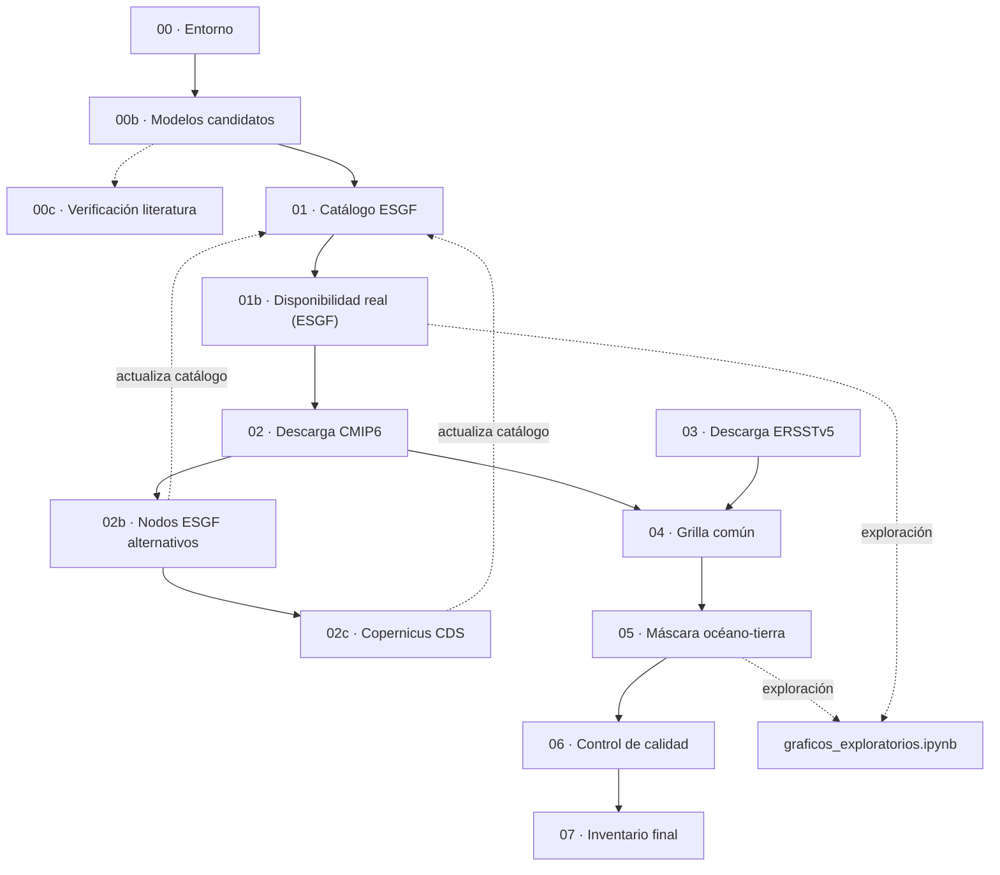

# Pipeline de datos SST — CMIP6 + ERSSTv5 (Niño 1+2 / Niño 3.4)

Pipeline de datos para calcular el *Time of Emergence* (TOE) de la temperatura superficial del mar en las regiones Niño 1+2 y Niño 3.4. Cubre la adquisición de los modelos CMIP6 y del dato observado de referencia (ERSSTv5), su homogeneización y su control de calidad, hasta un producto final listo para el análisis.

Se ejecuta con un único orquestador: `run.sh [STEP_FROM] [STEP_TO] [MAX_MODELS]`. El procesamiento numérico usa CDO, salvo la máscara océano-tierra (paso 05), en Python/`numpy`. El pipeline **no genera gráficos**: se producen bajo demanda desde `graficos_exploratorios.ipynb`, a partir de `data/processed/masked/`.

## Configuración global (`config/periods.yaml`)

Los experimentos que procesa todo el pipeline (`historical` + los escenarios SSP) se definen en un único lugar: `config/periods.yaml`, clave `escenarios`. Ningún script debe tener una lista de SSP fija en el código: todos leen esta configuración a través de `scripts/pipeline_config.py`, que expone:

- `experiments()` — `historical` + los escenarios configurados, en orden.
- `scenarios()` — solo los escenarios SSP.
- `experiment_year_range(exp)` — rango de años de descarga/recorte por experimento.
- `cds_experiment_name(exp)` — nombre de experimento en el formato de Copernicus CDS.

Para agregar o quitar un escenario SSP, alcanza con editar `escenarios` en `config/periods.yaml`; no hace falta tocar los scripts.

## Flujograma


```mermaid
flowchart TD
    S00["00 · Entorno"]
    S00b["00b · Modelos candidatos"]
    S00c["00c · Verificación literatura"]
    S01["01 · Catálogo ESGF"]
    S01b["01b · Disponibilidad real (ESGF)"]
    S02b["02b · Nodos ESGF alternativos"]
    S02c["02c · Copernicus CDS"]
    S02["02 · Descarga CMIP6"]
    S03["03 · Descarga ERSSTv5"]
    S04["04 · Grilla común"]
    S05["05 · Máscara océano-tierra"]
    S06["06 · Control de calidad"]
    S07["07 · Inventario final"]

    S00 --> S00b --> S01
    S00b -.-> S00c
    S01 --> S01b --> S02
    S02 --> S02b --> S02c
    S02b -.->|"actualiza catálogo"| S01
    S02c -.->|"actualiza catálogo"| S01
    S02 --> S04
    S03 --> S04
    S04 --> S05
    S05 --> S06 --> S07
    S05 -."exploración".-> NB["graficos_exploratorios.ipynb"]
    S01b -."exploración".-> NB
```

`02 → 02b → 02c` es una cascada **automática** dentro del paso 02 de `run.sh` (`02_download_all_sources.sh`): cada fuente solo se intenta para lo que la anterior no haya resuelto. Las líneas punteadas son pasos manuales (00c) o de solo lectura para el notebook (01b), o actualizaciones que 02b/02c hacen sobre el catálogo de 01.

## Estructura de datos

```
data/raw/cmip6/<modelo>/<experimento>/<chunk>.nc   # 02: crudo, grilla nativa, sin fusionar
data/raw/ersstv5/                                  # 03: observado, crudo
data/interim/.weights/<modelo>.nc                  # 04: pesos de regrilla, uno por modelo (cache)
data/interim/processed/tos_<modelo>_<exp>.nc       # 04: regrillado + fusionado + homogeneizado
data/interim/ocean_mask.nc                         # 05: máscara 1=océano
data/processed/masked/tos_<modelo>_<exp>.nc        # 05: dato final, listo para el cálculo de TOE
data/processed/qc_report.csv                       # 06
data/processed/models_inventory_final.csv          # 07
figures/                                            # graficos_exploratorios.ipynb (manual)
```

`data/interim/processed/` es un paso intermedio (regrillado, todavía sin máscara); `data/processed/masked/` es el dato final. `run.sh` no escribe ningún PNG: todo el graficado se hace desde `graficos_exploratorios.ipynb`, que lee `data/processed/masked/` y guarda los PNG en `figures/`.

## Pasos

### 00 — Verificación de entorno (`00_setup_env.sh`)
Confirma la disponibilidad de CDO, Python y las librerías necesarias antes de iniciar la ejecución.

### 00b — Lista de modelos candidatos (`00b_build_model_list.py`)
Revisa el vocabulario CMIP6 completo y selecciona, por modelo, la grilla (`grid_label`) más gruesa que cubre todos los experimentos requeridos (`config/periods.yaml`). Escribe `config/models_seed_cmip6.csv`.

### 00c — Verificación contra la literatura (`00c_check_paper_models.py`, manual)
Compara los modelos citados en `files_MD/` contra ese catálogo. Los faltantes quedan en `config/models_missing_from_esgf.csv`, insumo manual adicional para 02b si se quiere ampliar el universo de modelos.

### 01 — Catálogo ESGF (`01_query_esgf_catalog.py`)
Para cada modelo, determina el `variant_label` (miembro de ensamble) disponible simultáneamente en todos los experimentos requeridos (prioriza `r1i1p1f1`) y localiza los archivos de esa combinación exacta. Escribe `models_catalog_status.csv` y `esgf_file_urls.json`.

### 01b — Disponibilidad real por modelo (`check_model_availability.py`)
Reconsulta ESGF en vivo, modelo por modelo, qué experimentos tiene publicados cada uno para `tos/Omon` (union de `models_catalog_status.csv` y `config/models_missing_from_esgf.csv`, es decir un universo más amplio que el filtrado por 00b). Escribe `informe/model_availability_report.csv`/`.md`, que usa `graficos_exploratorios.ipynb` para el resumen de control de calidad.

**Idempotente pero distinto al resto**: son cientos de peticiones a ESGF, así que solo corre la primera vez que se ejecuta el pipeline en una máquina (o después de borrar el CSV a mano); si `informe/model_availability_report.csv` ya existe, este paso lo detecta, avisa por consola y no vuelve a consultar nada. Ese CSV **no se versiona** (está en `.gitignore`): es una foto de la disponibilidad real al momento de correrlo, no algo para mantener sincronizado a mano en git.

### 02 — Descarga CMIP6, en cascada (`02_download_all_sources.sh`)
Encadena automáticamente 3 fuentes, cada una solo para lo que la anterior no haya resuelto:

1. **`02_download_cmip6_chunks.sh`**: descarga cada archivo tal como lo entrega ESGF (nodo principal), sin fusionar ni recortar, en `data/raw/cmip6/<modelo>/<experimento>/`. `MAX_MODELS` limita cuántos modelos completos se descargan.
2. **`02b_search_alt_esgf_nodes.py`**: para los modelos `no_encontrado`, repite la búsqueda de 01 contra nodos ESGF alternativos (CEDA, DKRZ, IPSL, NSC, NCI) y actualiza el catálogo.
3. **`02c_download_copernicus_cds.py`**: último recurso, vía Copernicus CDS, **solo para modelos que además están en `config/models_copernicus_ssp245_whitelist.csv`**. Esa lista blanca se verificó a mano contra Copernicus únicamente para `ssp245` — al agregar un escenario SSP nuevo, la disponibilidad de ese escenario en Copernicus para esos modelos no está garantizada y debería revisarse aparte. Requiere `~/.cdsapirc`; si no está disponible, el paso se omite sin abortar el resto del pipeline.

### 03 — ERSSTv5 (`03_download_ersstv5.sh`)
Descarga el dato observado de NOAA PSL, aísla la variable `sst` y recorta a la ventana regional (100°E–70°W, 20°S–20°N). El resultado (`ersstv5_region.nc`) es la grilla de referencia (~2°) para el paso 04.

### 04 — Procesamiento a grilla común (`04_process_to_common_grid.sh`)
Por modelo:
1. **Pesos de regrilla, una sola vez por modelo**: se detecta el `gridtype` nativo (`cdo griddes`) y se calculan los pesos hacia la grilla de ERSSTv5 con `gencon` (mallas no estructuradas, p. ej. AWI-CM-1-1-MR) o `genbil` en los demás casos. Se cachean en `data/interim/.weights/<modelo>.nc` y se reutilizan para todos los experimentos del modelo.
2. `cdo remap` con esos pesos, chunk por chunk (recorta además el dominio a la ventana regional).
3. `mergetime` de los chunks regrillados de un mismo experimento.
4. Recorte de años según el experimento (rango leído de `config/periods.yaml` vía `pipeline_config.py`).
5. Calendario `standard` si no está presente.
6. Conversión de unidades (K → degC) cuando corresponde.

Salida: `data/interim/processed/tos_<modelo>_<exp>.nc`.

### 05 — Máscara océano-tierra (`05_apply_ocean_mask.py`, Python)
Construye una máscara 1=océano a partir de los puntos válidos de ERSSTv5 (océano si registra al menos un mes válido en todo su periodo) y la aplica por igual a todos los archivos modelo×experimento del paso 04. Al derivarse del observado en vez de usar `sftlf` por modelo, garantiza que todas las fuentes compartan la misma huella válida/faltante. Salida: `data/processed/masked/`.

### 06 — Control de calidad (`06_qc_checks.py`)
Filtro de aceptación: por archivo, evalúa el rango físico de la SST (−2 a 39 °C) y la longitud temporal esperada (10 % de tolerancia, derivada de `config/periods.yaml`), y clasifica cada combinación modelo-experimento como PASS o FAIL en `qc_report.csv`. Es el criterio que usa el paso 07 para el inventario final.

### 07 — Inventario final (`07_build_inventory_report.py`)
Combina el resultado del control de calidad con la resolución real de cada modelo (`cdo griddes`) en una tabla resumen con los modelos finalmente seleccionados.

### `graficos_exploratorios.ipynb` (manual, no forma parte de `run.sh`)
Notebook de graficado sobre `data/processed/masked/`; los PNG se guardan en `figures/`. Contiene mapas, series de caja por modelo/periodo, resumen de control de calidad y boxplots comparativos. Al igual que los scripts de `scripts/`, lee los escenarios SSP de `config/periods.yaml` (vía `pipeline_config.py`) en vez de tenerlos fijos en el código.

El resumen de control de calidad (`plot_qc_summary`) lee la disponibilidad real de cada modelo desde `informe/model_availability_report.csv` (paso 01b, ver arriba) en vez de una lista fija en el notebook. Si se agrega o quita un escenario SSP en `config/periods.yaml`, ese CSV queda con columnas viejas hasta que se borra y se vuelve a generar (paso 01b es idempotente, no se regenera solo):
```
rm informe/model_availability_report.csv informe/model_availability_report.md
python3 scripts/check_model_availability.py
```

## Convenciones

- **Idempotencia**: todo paso que procesa datos por modelo verifica si la salida ya existe y la omite, lo que permite reanudar o ampliar `MAX_MODELS` sin repetir trabajo. El paso 01b lleva esto al extremo: si su CSV de salida existe, no hace ninguna verificación parcial ni actualización incremental, directamente no corre.
- **`MODELS`** (variable de entorno, opcional): restringe el paso 04 a una lista de modelos separada por espacios.
- **Un solo miembro de ensamble** (`variant_label`) por modelo, consistente en todos los experimentos requeridos (ver paso 01).
- **Mallas no estructuradas**: el paso 04 detecta el `gridtype` nativo y usa `gencon` automáticamente cuando `genbil` no aplica; la salida queda en la misma grilla para todos los modelos.
